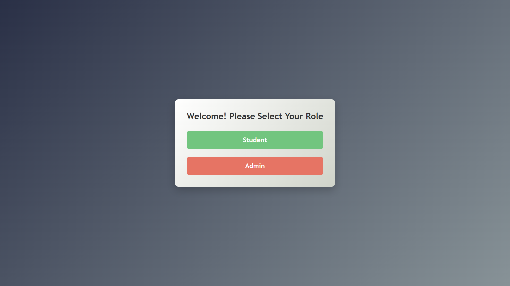
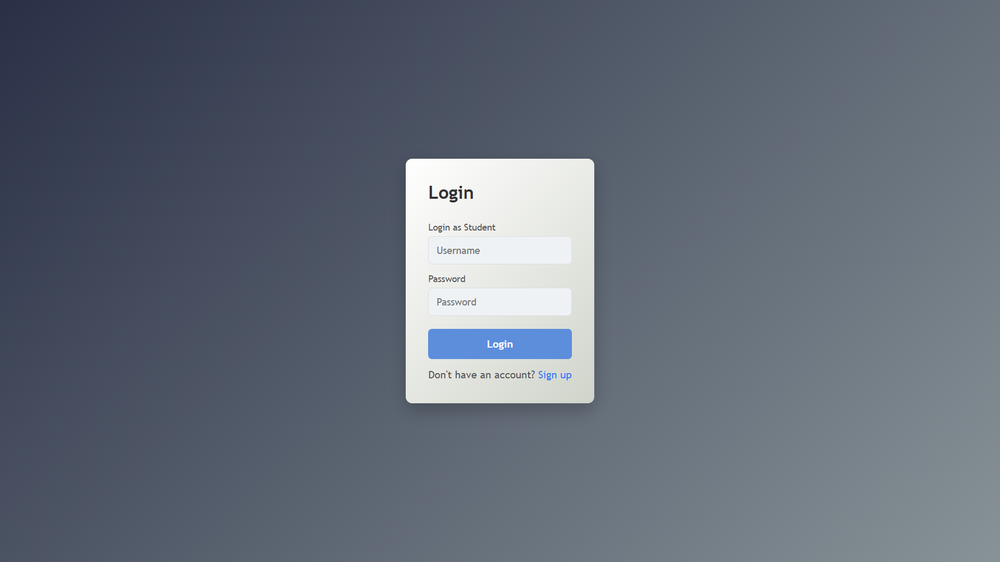
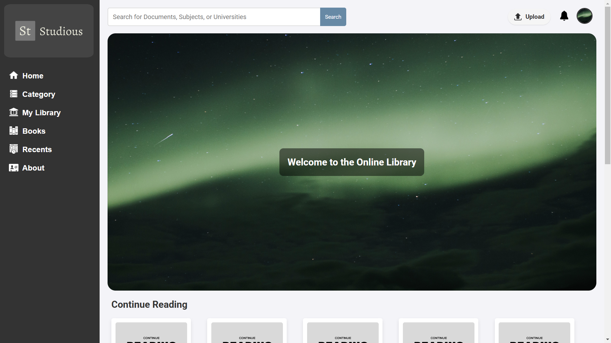
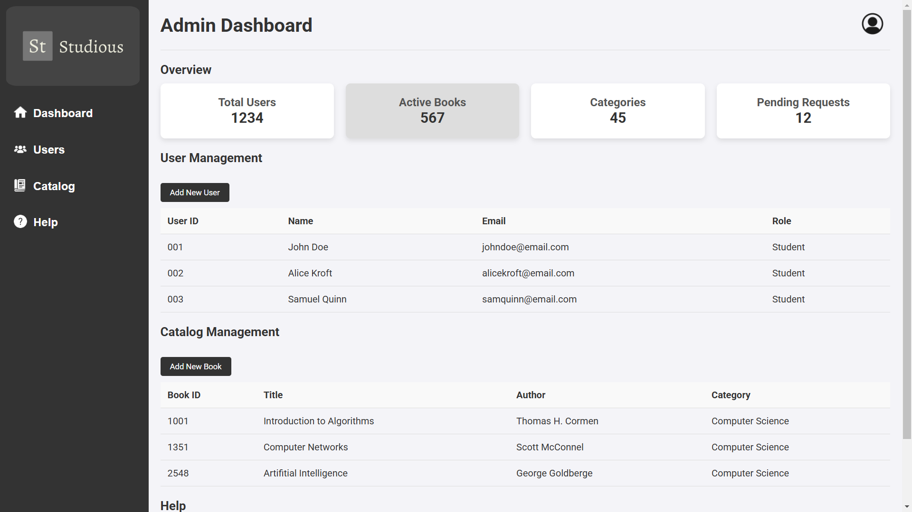
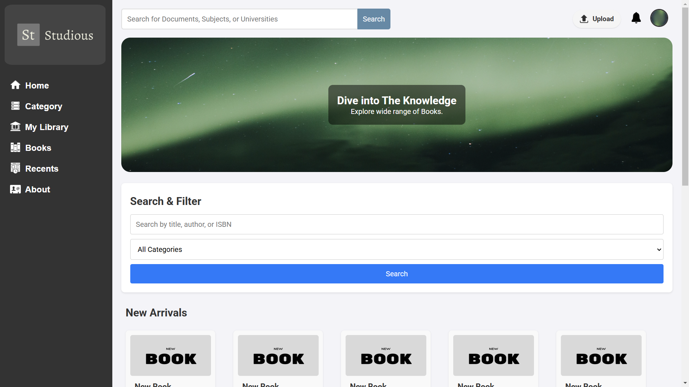
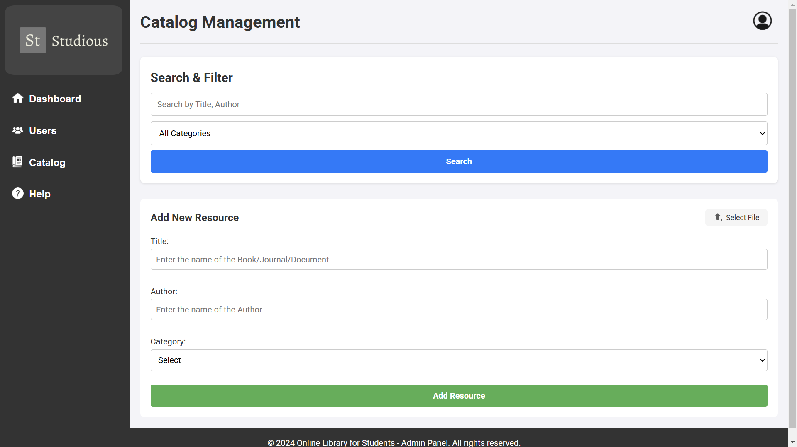

# Studious - Online Library Platform

**Studious** is an online library platform built for students and admins. Students can browse, search, and manage books, while admins handle the catalog, users, and other admin tasks. It’s made with HTML, CSS, and JavaScript, keeping the vibe clean and easy to use.

---

## Project Structure

Here’s how the project is laid out:

- **`admin/`**: Pages for admin stuff like managing the catalog, users, and help.
- **`student/`**: Pages for students to browse books, check categories, and handle their library.
- **`login/`**: Login, signup, and role selection pages.
- **`public/`**: Static stuff like images, icons, and shared scripts.
- **`screenshots/`**: Folder with screenshots of key pages and features.

---

## Features

What this project brings to the table:

- **Role-Based Access**: Log in as a student or admin, with different tools for each.
- **Student Features**:
  - Browse and search books.
  - Check out book categories.
  - Manage your library (favorites, saved books, etc.).
  - See recently viewed stuff.
- **Admin Features**:
  - Add, edit, or delete books in the catalog.
  - Manage users (view, add, remove).
  - Hit up help and support pages.
- **Responsive Design**: Works smooth on desktops, tablets, and phones.

---

## Deployment

Tried deploying this on Vercel and GitHub Pages to show it off, but shit hit the fan. The live version ain’t working right now due to some technical headaches:

- **404 Errors**: Subpages like `/login/index.html` or `/student/home-student.html` wouldn’t load—kept getting 404s even with the setup looking right.
- **CSS Not Loading**: Styles went MIA on the deployed site, leaving pages looking raw.
- **Redirects Failing**: JavaScript redirects were acting up ‘cause of path problems.

Since deployment’s a no-go for now, I’ve attached screenshots of some key pages to this `README.md` and dumped the rest in the `screenshots/` folder to show what’s up with the platform.

---

## Screenshots

Since the live deployment isn’t up, here are some key screenshots to show the platform in action. More are in the `screenshots/` folder if you need them.

### Role Selection Page
This is where users choose if they’re a Student or Admin.  


### Login Page
The login screen for both Students and Admins.  


### Student Home Page
The dashboard students see after logging in.  


### Admin Home Page
The admin dashboard for managing stuff.  


### Book Browsing Page
Where students browse and search for books.  


### Catalog Management Page
Where admins add, edit, or delete books.  


**Note**: Check the `screenshots/` folder in the repo for additional shots.

---

## How to Run Locally

Wanna see it in action? Here’s how to run it on your machine:

1. **Clone the Repo**:
   ```bash
   git clone https://github.com/irfan-rg/studious

2. **Jump into the Folder**:
    ```bash
   cd studious

3. **Open the Role Selection Page**:
- Fire up login/index.html in your browser (Chrome, Firefox, whatever).
- Or, for a smoother ride, use a local server:
    ```bash
    npx serve

4. **Check It Out**:
- Pick a role (Student or Admin) and log in.
- Mess around with the navigation to see the pages.

- **Heads Up**: This is a static site—no backend needed, all interactions are mocked.

## Technologies Used

What I built this with:

- **HTML5**: For the page bones.
- **CSS3**: For styling and making it responsive.
- **JavaScript**: For interactivity like forms and redirects.
- **Git & GitHub**: For version control and hosting the repo.

## Challenges and Learnings

This project threw some curveballs:

- **Deployment Fails**: Figuring out why Vercel and GitHub Pages weren’t playing nice.
- **Path Problems**: Getting file paths (CSS, images, scripts) to work everywhere.
- **Responsive Design**: Making it look dope on all screen sizes.

Learned a ton about deployment quirks and keeping paths tight, though!

## Conclusion

**Studious** is a solid online library platform for students and admins alike. Deployment didn’t pan out, but the screenshots prove it’s functional and clean. Hope this sets the stage for more dope updates down the line.

Hit me up at *irfanrgulagundi@gmail.com* if you got questions or feedback!